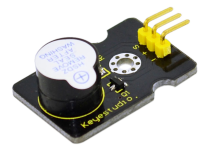
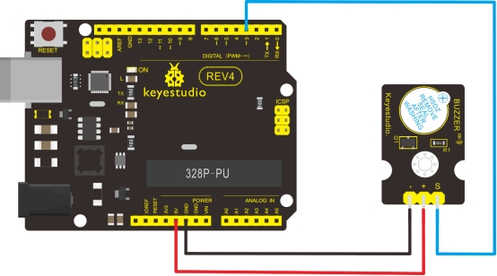

### Project 11 Digital Buzzer Module



**1.Introduction**

Here is the simplest sound making module. You can use high/low level to drive it. Changing the frequency it buzzes can produce different sound. This module is widely used on your daily appliance, like PC, refrigerator, phones etc. And you can also create many interesting interactive project with this small but useful module. Just try it!! You will find the electronic sound it creates so fascinating.

**2.Specification**

- Working voltage: 3.3-5v
- Interface type: digital
- Size: 30*20mm
- Weight: 4g

**3.Connection Diagram**



**4.Sample Code**

```c
int buzzPin =  3;    //Connect Buzzer on Digital Pin3

void setup()  
{        
  pinMode(buzzPin, OUTPUT);     
}

void loop()                     
{
  digitalWrite(buzzPin, HIGH);
  delay(1);
  digitalWrite(buzzPin, LOW); 
  delay(1);        
}
```

