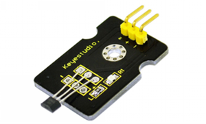
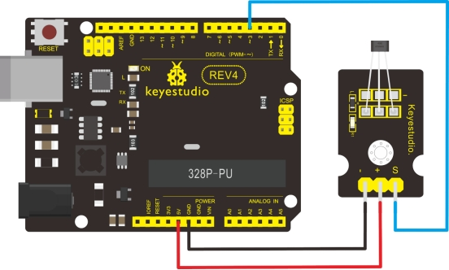

### Project 12 Hall Magnetic Sensor



**1.Introduction**

This is a Magnetic Induction Sensor. It senses the magnetic materials within a detection range up to 3cm. The detection range and the strength of the magnetic field are proportional. The output is digital on/off. This sensor uses the SFE Reed Switch - Magnetic Field Sensor.

**2.Specification**

- Sensing magnetic materials
- Detection range: up to 3cm
- Output: digital on/off
- Detection range and magnetic field strength are proportional
- Size: 30*20mm
- Weight: 3g

**3.Connection Diagram**



**4.Sample Code**

```c
int ledPin = 13;                // choose the pin for the LED
int inputPin = 3;               // Connect sensor to input pin 3 
int val = 0;                    // variable for reading the pin status
 
void setup() 
{
  pinMode(ledPin, OUTPUT);      // declare LED as output
  pinMode(inputPin, INPUT);     // declare pushbutton as input
}
```

