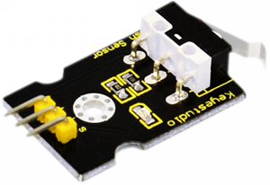
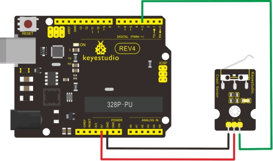

### Project 13 Keyestudio collision sensor



**1.Introduction**

Collision sensor, also known as electronic switch, is a digital on-off input module necessary for elementary electronic learning. By programming, it can realize control over light, sound device, key choice function of LCD display etc. Using 3P sensor cable to connect it to sensor shield, it can be installed to 4WD AL alloy mobile robot platform to realize collision detection function. It is both convenient and efficient.

**Note:** You can make a collision flasher using collision module and built-in LED on interface 13. Connect the collision senser to pin 3, when the collision sensor senses a collision signal, the LEDs on mainboard and module will light up simultaneously.

**2.Specification**

1. If collision happens upfront of where collision module is installed, module outputs low level signal; no collision, outputs high level signal.
2. Module reserves M3 mounting hole, convenient for fixation on a car.
3. Module size: 3.1cm * 2.1cm
4. With switch indicator light, if there is collision, light is on; no collision, light is out.

**3.Pin definition**

+ 3v-12v power supply  

- GND  
- S  Gigh-low level output

**4.Circuit connection**



**5.Sample program**

```c
int ledPin = 13;                // choose the pin for the LED
int inputPin = 3;               // Connect sensor to input pin 3 
int val = 0;                    // variable for reading the pin status
 
void setup() 
{
  pinMode(ledPin, OUTPUT);      // declare LED as output
  pinMode(inputPin, INPUT);     // declare pushbutton as input
}
 
void loop()
{
  val = digitalRead(inputPin);  // read input value
  if (val == HIGH) 
  {            // check if the input is HIGH
    digitalWrite(ledPin, LOW);  // turn LED OFF
  } 
  else 
  {
    digitalWrite(ledPin, HIGH); // turn LED ON
  }
}
```

