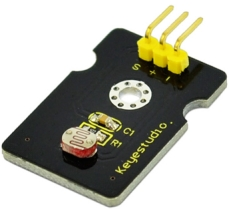
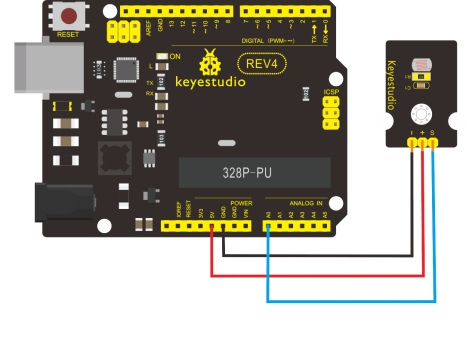

### Project 15 Photocell sensor



**1.Introduction**

Photocell is commonly seen in our daily life and is mainly used in intelligent switch, also in common electronic design. To make it easier and more effective, we supply corresponding modules.

Photocell is a semiconductor. It has features of high sensitivity, quick response, spectral characteristic, and R-value consistence, maintaining high stability and reliability in environment extremes such as high temperature, high humidity. It’s widely used in automatic control switch fields like cameras, garden solar lights, lawn lamps, money detectors, quartz clocks, music cups, gift boxes, mini night lights, sound and light control switches, etc.

**2.Specification**

- Interface type: analog
- Working voltage: 5V
- Size: 30*20mm
- Weight: 3g

**3.Connection Diagram**



**4.Sample Code**

```c
int sensorPin =A0 ; 
int value = 0; 

void setup() 
{
  Serial.begin(9600); 
} 

void loop() 
{
  value = analogRead(sensorPin); 
  Serial.println(value, DEC); 
  delay(50); 
}
```

