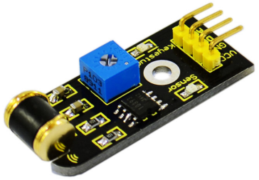

### Project 16 Vibration Sensor



**1.Introduction**

What's the simplest way to check vibration with Arduino? Well, use a vibration sensor from keyestudio. You can directly plug it on our sensor Shield V5, vibrate this sensor, and Arduino can receive a digital signal, making it easy to make computation and programs in Arduino. Despite its simplicity, you can make full use of it with creative thinking, step counting, and crash warning light etc. 

**2.Specification**

- IO Type: Digital
- Supply Voltage: 3.3V to 5V
- Size: 40.7*16.7mm
- Weight: 5g

**3.Connection Diagram**


**4.Sample Code**

```c
#define SensorLED     13
#define SensorINPUT   3  //Connect the sensor to digital Pin 3 which is Interrupts 1.
unsigned char state = 0;

void setup() 
{ 
  pinMode(SensorLED, OUTPUT); 
  pinMode(SensorINPUT, INPUT);
  attachInterrupt(1, blink, FALLING);// Trigger the blink function when the falling edge is detected
}

void loop()
{  
	if(state!=0)
    {
        state = 0;
        digitalWrite(SensorLED,HIGH);
        delay(500);
    }  
    else
        digitalWrite(SensorLED,LOW);
} 

void blink()//Interrupts function
{  
	state++;
}
```

