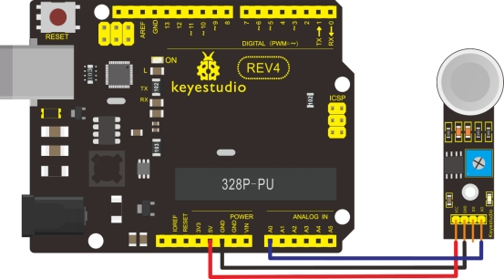

### Project 17 Analog Gas Sensor


**1.Introduction**

This analog gas sensor - MQ2 is used in gas leakage detecting equipment in consumer electronics and industrial markets. This sensor is suitable for detecting LPG, I-butane, propane, methane, alcohol, Hydrogen and smoke. It has high sensitivity and quick response. In addition, the sensitivity can be adjusted by the potentiometer. 

**2.Specification**

- Power supply: 5V
- Interface type: Analog
- Wide detecting scope
- Quick response and High sensitivity
- Simple drive circuit
- Stable and long lifespan
- Size: 49.7*20mm
- Weight: 8g

**3.Connection Diagram**



**4.Sample Code**

```c
void setup()
{
   Serial.begin(9600); //Set serial baud rate to 9600 bps
}

void loop()
{
    int val;
    val=analogRead(0);//Read Gas value from analog 0
    Serial.println(val,DEC);//Print the value to serial port
    delay(100);
}
```

