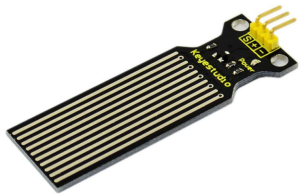
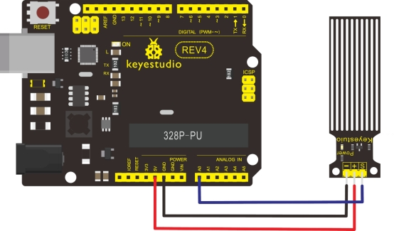

### Project 18 keyestudio Water Sensor



**1.Introduction**

Our water sensor is easy- to-use, portable and cost-effective, designed to identify and detect water level and water drop. This sensor measures the volume of water drop and water quantity through an array of traces of exposed parallel wires. Compared with its competitors, this sensor is not only smaller and smarter but also ingeniously equipped with following features:

- smooth conversion between water quantity and analog quantity;
- strong flexibility, this sensor outputs basic analog value;
- low power consumption and high sensitivity;
- directly connected to microprocessor or other logic circuits, suitable for a variety of development boards and controllers such as Arduino controller, STC single-chip microcomputer, AVR single-chip microcomputer etc.

**2.Specification**

- Product name: Water Sensor
- Operating voltage: DC5V
- Operating current: ﹤20mA
- Sensor type: Analog
- Detection area: 40mm x16mm
- Production process: FR4 double-side tinned
- Humanized design: Anti-slippery semi-lunar recess
- Operating temperature: 10%~90% without condensation
- Product weight: 3g
- Product size: 65mm x 20mm x 8mm

**3.Connection Diagram**



**4.Sample Code**

```c
int analogPin = 0; //connect water sensor to analog interface 0
int led = 13; //LED to digital interface 13 
int val = 0; //define the initial value of variable ‘val’ as 0
int data = 0; //define the initial value of variable ‘data’ as 0 

void setup()
{
    pinMode(led, OUTPUT); //define led as output pin
    Serial.begin(9600); //set baud rate at 9600
}

void loop()
{
    val = analogRead(analogPin); //read and assign analog value to variable ’val’
    if(val>700)
    { //decide whether variable ‘val’ is over 700 
    	digitalWrite(led,HIGH); //turn on  LED when variable ‘val’ is over 700
    }
    else
    {
    	digitalWrite(led,LOW); //turn off LED when variable ‘val’ is under 700
    }
    data = val; //variable ’val’ assigns value to variable ‘data’
    Serial.println(data); //print variable ‘data’ by Serial.print
    delay(100);
}
```

After the above steps are done, let’s do a test on lower water level and check what happens: The LED can’t light up when water level haven’t reach alarm value; The LED turns on and released an alarm when water level reaches alarm value;