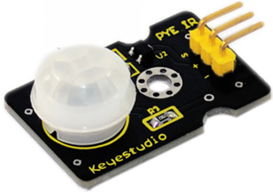
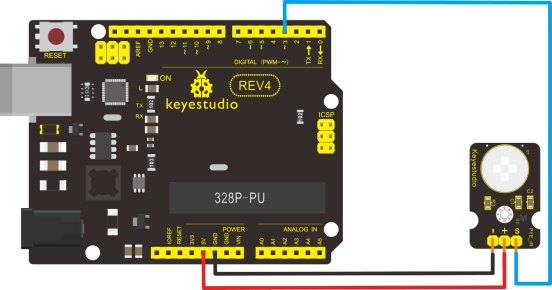

### Project 19 PIR Motion Sensor



**1.Introduction**

Pyroelectric infrared motion sensor can detect infrared signals from a moving person or moving animal, and output switching signals. It can be applied to a variety of occasions to detect the movement of human body. Conventional pyroelectric infrared sensors require body pyroelectric infrared detector, professional chip, complex peripheral circuit, so the size is bigger, with complex circuit, and lower reliability. Now we launch this new pyroelectric infrared motion sensor, specially designed for Arduino. It uses an integrated digital body pyroelectric infrared sensor, has smaller size, higher reliability, lower power consumption and simpler peripheral circuit.

**2.Specification**

- Input Voltage: 3.3 ~ 5V, 6V Maximum
- Working Current: 15uA
- Working Temperature: -20 ~ 85 ℃
- Output Voltage: High 3V, low 0V
- Output Delay Time (High Level): About 2.3 to 3 Seconds
- Detection angle: 100 °
- Detection distance: 7 meters
- Output Indicator LED (When output HIGH, it will be ON)
- Pin limit current: 100mA
- Size: 30*20mm
- Weight: 4g

**3.Connection Diagram**



**4.Sample Code**

```c
byte sensorPin = 3;
byte indicator = 13;

void setup()
{
  pinMode(sensorPin,INPUT);
  pinMode(indicator,OUTPUT);
  Serial.begin(9600);
}

void loop()
{
  byte state = digitalRead(sensorPin);
  digitalWrite(indicator,state);
  if(state == 1)
  	Serial.println("Somebody is in this area!");
  else if(state == 0)
  	Serial.println("No one!");
  delay(500);
}
```

